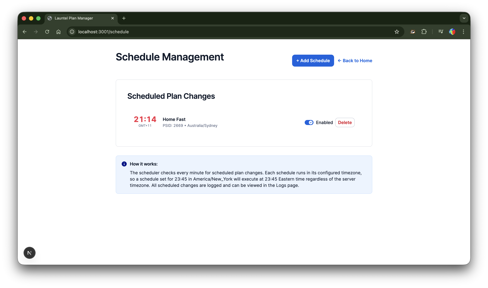
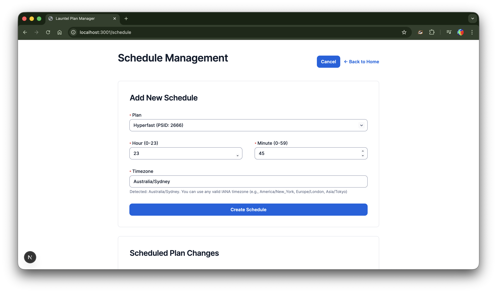
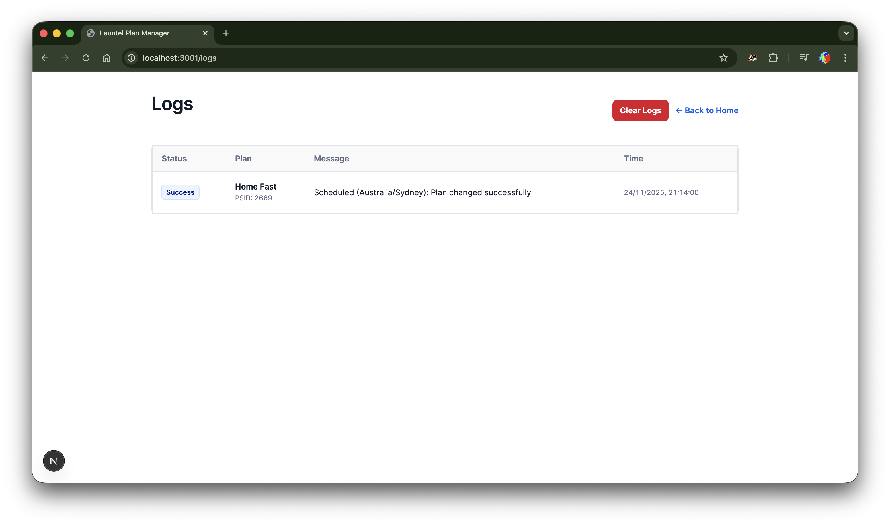

# Launtel Plan Manager

A modern web-based application for managing Launtel internet plan changes with scheduled automation, real-time monitoring, and comprehensive logging.

## Features

- **Current Plan Display** - View your current plan, balance, and usage details in real-time
- **Manual Plan Changes** - Trigger immediate plan changes through the dashboard
- **Scheduled Changes** - Automate plan changes at specific times of day
- **Comprehensive Logging** - View history of all plan changes with success/failure status
- **Settings Management** - Configure Launtel credentials and parameters through the UI
- **Background Scheduler** - Automatic execution of scheduled plan changes
- **Modern UI** - Clean, responsive interface built with Next.js and Tailwind CSS


## Screenshots

### Schedule Management


Manage automated plan changes with timezone support. Enable/disable schedules with a simple toggle.

### Creating a New Schedule


Easily create new schedules by selecting a plan, time, and timezone. The form auto-detects your browser timezone.

### Logs Viewer


View comprehensive history of all plan changes with timestamps, success/failure status, and detailed messages.

## Quick Start

### Prerequisites

- Node.js 18+ (LTS recommended)
- npm or yarn

### Installation

1. **Clone the repository and install dependencies**:

```bash
npm install
```

2. **Start the development server**:

```bash
npm run dev
```

3. **Access the application**:

Open your browser and navigate to http://localhost:3000

4. **Configure settings**:

Navigate to the Settings page and configure your Launtel credentials (stored securely in SQLite).

## Production Deployment

### Standard Deployment

1. **Build the application**:

```bash
npm run build
```

2. **Start the production server**:

```bash
npm start
```

The server will run on port 3000 by default.

### Docker Deployment

**Quick start with Docker Compose:**

```bash
docker-compose up -d
```

**Manual Docker build:**

```bash
# Build the image
docker build -t launtel-plan-manager .

# Run the container
docker run -d \
  -p 3000:3000 \
  -v $(pwd)/data:/app/data \
  --restart unless-stopped \
  launtel-plan-manager
```

See [DOCKER.md](DOCKER.md) for comprehensive Docker deployment instructions.

## Configuration

### Initial Setup

1. Navigate to http://localhost:3000/settings
2. Fill in your Launtel credentials:
   - **Base URL**: `https://residential.launtel.net.au` (default)
   - **Username**: Your Launtel email
   - **Password**: Your Launtel password
   - **User ID**: Your Launtel user ID
   - **Service ID**: Your service ID
   - **AVC ID**: Your AVC ID
   - **Location ID**: Your location ID

### Optional Settings

- **Discount Code**: If you have a discount code
- **Timeout (ms)**: Request timeout in milliseconds (default: 15000)

All settings are securely stored in a SQLite database at `data/plan-changer.db`.

## Usage

### View Current Plan

The home page and dashboard display your current plan information including:
- Service name and status
- Speed tier
- Daily price
- Current balance
- Today's and tomorrow's charges
- Estimated days remaining

### Manual Plan Change

1. Navigate to the **Dashboard** page
2. Select a plan from the available options
3. Click **Change Plan Now**
4. View the result in the alert message

### Schedule Automatic Plan Changes

1. Navigate to the **Schedule** page
2. Click **Add Schedule**
3. Select a plan and time (hour and minute)
4. Click **Create Schedule**
5. The scheduler will automatically execute the plan change at the specified time

### View Logs

1. Navigate to the **Logs** page
2. View all plan change history with timestamps
3. Filter by success/failure status
4. Clear logs if needed

## Available Plans

The following plans are supported (PSIDs are automatically mapped):

- **Standby** (2623)
- **nbn100/20** (2613)
- **nbn100/40** (2608)
- **Home Fast** (2669)
- **Home SuperFast** (2615)
- **Ultrafast-100** (2617)
- **nbn250/100** (2664)
- **Hyperfast** (2666)
- **IoT 1Mbps** (2629)
- **IoT 4Mbps** (2635)

## How It Works

1. **Web Server** - Next.js application runs as a persistent web server
2. **Background Scheduler** - node-cron checks every minute for scheduled tasks
3. **Plan Change Service** - Automated login and form submission to Launtel portal
4. **Database** - SQLite stores settings, schedules, and logs
5. **UI** - React components provide interactive interface

### Scheduler Behavior

- Runs every minute in the background
- Checks for enabled schedules matching current time
- Executes plan changes automatically
- Logs all results to the database
- No manual intervention required

## Technology Stack

- **Frontend**: Next.js 16, React, TypeScript
- **Styling**: Tailwind CSS
- **Backend**: Next.js API Routes
- **Database**: SQLite (better-sqlite3)
- **Scheduler**: node-cron
- **HTTP Client**: axios with cookie jar support
- **HTML Parsing**: cheerio

## Development

### Commands

```bash
# Install dependencies
npm install

# Development mode with hot reload
npm run dev

# Build for production
npm run build

# Start production server
npm start

# Clean build artifacts
npm run clean
```

### Project Structure

```
app/                    # Next.js App Router
├── api/               # API routes
│   ├── current-plan/  # Current plan info
│   ├── logs/          # Log retrieval and management
│   ├── plans/         # Plan operations
│   ├── schedules/     # Schedule CRUD
│   └── settings/      # Settings CRUD
├── dashboard/         # Dashboard page
├── logs/             # Logs viewer
├── schedule/         # Schedule management
├── settings/         # Settings configuration
├── layout.tsx        # Root layout
├── page.tsx          # Home page
└── globals.css       # Global styles

lib/                   # Core business logic
├── db/               # Database layer
│   └── index.ts      # SQLite schema and CRUD
├── services/         # Service modules
│   └── plan-changer.ts  # Launtel plan change service
└── scheduler.ts      # Background scheduler

data/                  # SQLite database (gitignored)
```

## Migration from Cron Version

This application replaces the original cron-based script with a modern web application. Key differences:

- **UI instead of CLI**: Web interface instead of command-line arguments
- **Database storage**: Settings and schedules stored in SQLite instead of .env file
- **Background scheduler**: Integrated scheduler instead of system cron
- **Comprehensive logging**: Database logging with web viewer instead of file logs
- **Real-time monitoring**: View current plan status and balance

## Security

- Credentials are stored in SQLite database (not in version control)
- Passwords are never returned by the API (only `hasPassword` flag)
- Docker container runs as non-root user (UID 1001)
- HTTPS used for all Launtel portal requests
- CSRF tokens handled automatically
- Session cookies managed per request

## Troubleshooting

### Database Issues

If you encounter database errors:

```bash
# Remove the database and restart
rm -f data/plan-changer.db
npm run dev
```

### Port Already in Use

Change the port in your environment or command:

```bash
PORT=8080 npm run dev
```

### Scheduler Not Running

The scheduler initializes when the Next.js server starts. Check the console for:

```
[Scheduler] Initializing...
[Scheduler] Initialized successfully
```

### Docker Build Fails

Ensure you have the latest Docker version and try:

```bash
docker-compose build --no-cache
docker-compose up -d
```

## Support & Contributing

For issues, questions, or contributions, please refer to the project repository.

## License

ISC

## Disclaimer

This tool automates interactions with the Launtel residential portal. Ensure your usage complies with Launtel's Terms of Service and your account's security settings. The authors are not responsible for any account issues arising from automated usage.
